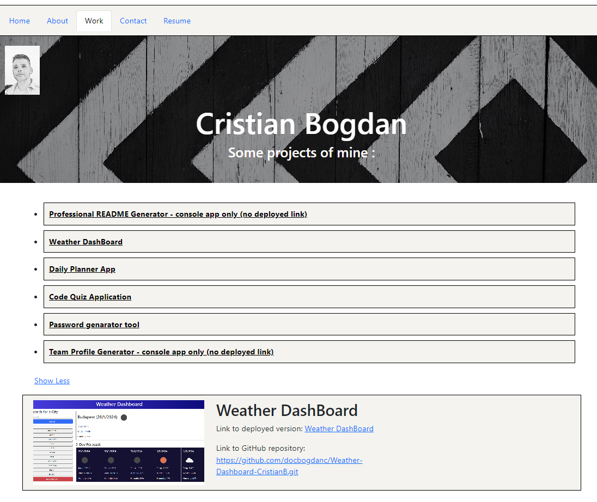

# React Portofolio CristianB

React Portofolio - part of Bootcamp challenge

## Description

This Project was created for bootcamp challenge.

It tests the knowledge gained in React Vite, JavaScript, HTML, CSS during the last weeks, especially the implementation of React Vite. It takes an old model of Portfolio created with Bootstrap (also part of Bootcamp challange) and create a new Portfolio based on React Vite code.

This is how the generated document looks :

## Installation

The repository is on the GitHub repositories public domain  https://github.com/docbogdanc/React-Portfolio-CristianB.git  and the deployed link is at https://rococo-bonbon-50ea3d.netlify.app/ where it was deployed with Netlify

## Usage

The code is free to be used according to the licence condition (please see the licence file from the GitHub repository)

## Credits

- Bootcamp EDX ( a big cheers for bootcamp teachers! ) provided the needed **materials**, the most wanted **inspiration** and the difficult to obtain **motivation**  

  
- React Vite

        https://vitejs.dev/guide/

- NPMs : react-router-dom 

        https://www.npmjs.com/package/react-router-dom

- Bootstrap 

        https://getbootstrap.com/
        

- Xpert Learning Assistant - the Bootcamp Course AI, used for helping with some of the javascript syntax
 
         https://bootcampspot.instructure.com/courses

- Markdown Guide used for styling the readme.md

         https://www.markdownguide.org/basic-syntax/

## License

MIT license

